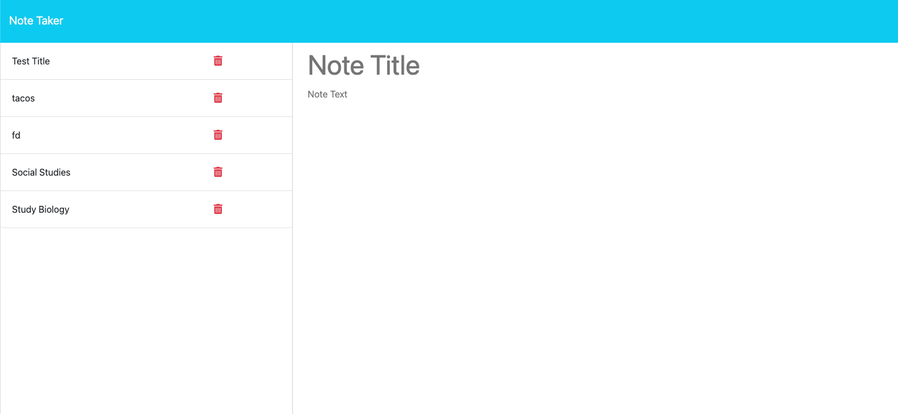

# Note Taker 
 Create, save, and delete notes when required with our app!

## Deployed on Heroku 
Link: https://immense-coast-03124-7ccec52b997b.herokuapp.com/notes

## Description
This is a note taker app tht is used to create, save, and delete notes.

## License

MIT License

Copyright (c) 2012-2023 Scott Chacon and others

Permission is hereby granted, free of charge, to any person obtaining
a copy of this software and associated documentation files (the
"Software"), to deal in the Software without restriction, including
without limitation the rights to use, copy, modify, merge, publish,
distribute, sublicense, and/or sell copies of the Software, and to
permit persons to whom the Software is furnished to do so, subject to
the following conditions:

The above copyright notice and this permission notice shall be
included in all copies or substantial portions of the Software.

THE SOFTWARE IS PROVIDED "AS IS", WITHOUT WARRANTY OF ANY KIND,
EXPRESS OR IMPLIED, INCLUDING BUT NOT LIMITED TO THE WARRANTIES OF
MERCHANTABILITY, FITNESS FOR A PARTICULAR PURPOSE AND
NONINFRINGEMENT. IN NO EVENT SHALL THE AUTHORS OR COPYRIGHT HOLDERS BE
LIABLE FOR ANY CLAIM, DAMAGES OR OTHER LIABILITY, WHETHER IN AN ACTION
OF CONTRACT, TORT OR OTHERWISE, ARISING FROM, OUT OF OR IN CONNECTION
WITH THE SOFTWARE OR THE USE OR OTHER DEALINGS IN THE SOFTWARE.

## Usage
This NoteiTaker Application utilizes Express.js to run.
1. Run "npm install" to install the dependencies the application will need
2. Launch the Server.js file to view the application in your default browser.

## Contributions
If you would like to contribute to this project please either fork or clone the repository. Once you have cloned or forked the repository, you can begin making changes.

## Tests 
n/a

## Questions
Github:https://github.com/c-wrenn

Email: crislynwren@yahoo.com

## Screenshots

